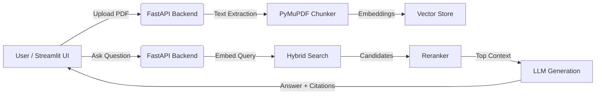

# IntelliDocs — AI-Powered Document Intelligence System

<p align="center">
  <strong>A general-purpose, production-ready Retrieval-Augmented Generation (RAG) system for interrogating PDFs with high accuracy and citation-backed answers.</strong>
</p>

## The Problem
Organizations have vast amounts of knowledge locked inside unstructured documents (annual reports, technical manuals, company policies, research papers). Finding specific information and synthesizing answers across these documents is time-consuming and error-prone. Standard keyword search is insufficient, and naive LLM wrappers frequently hallucinate answers without proper attribution.

## The Solution
**IntelliDocs** is an AI-powered document intelligence system that allows users to upload any PDF and ask questions in natural language. It leverages a robust RAG pipeline to ensure that every answer is accurate, contextual, and explicitly cited with the exact document and page number.

## Key Features

- 📄 **Universal PDF Support**: Upload any PDF document (reports, manuals, papers).
- 🔍 **Hybrid Retrieval**: Combines Semantic (Vector) Search and Keyword (BM25) Search to maximize retrieval accuracy.
- 🎯 **Reranking**: Retrieves multiple candidate chunks and reranks them to send only the most relevant context to the LLM.
- 🔗 **Citation-Based Answers**: Every answer provides the source document and page number, ensuring traceability and trust.
- 🛡️ **Hallucination Control**: If the uploaded documents do not contain the answer, the system gracefully responds with "I couldn't find enough information in the uploaded documents to answer this question."
- 💬 **Conversation History**: Supports follow-up questions for a natural chat experience.

## Architecture



## Tech Stack
- **Frontend**: Streamlit
- **Backend**: FastAPI, Python
- **Document Processing**: PyMuPDF
- **Retrieval Engine**: OpenSearch (Hybrid Vector + Keyword Search)
- **AI Models**: OpenAI (GPT-4o-mini for generation, text-embedding-3-small for embeddings)

## Installation & Running Locally

1. **Clone the repository and install dependencies**:
   ```bash
   pip install -r requirements.txt
   ```

2. **Set your OpenAI API Key**:
   ```bash
   export OPENAI_API_KEY="your-api-key-here"
   ```

3. **Start the FastAPI Backend**:
   ```bash
   uvicorn app.main:app --host 0.0.0.1 --port 8000
   ```

4. **Start the Streamlit Frontend**:
   ```bash
   streamlit run frontend/app.py
   ```

## Example Questions
- "What is the revenue for Q3?"
- "How did it change from last year?" (Follow-up)
- "Summarize the key findings in the introduction section."
- "What is the capital of France?" -> *System will abstain to prevent hallucinations.*

## Deployment
*Deployment instructions and live URL will be provided here.*